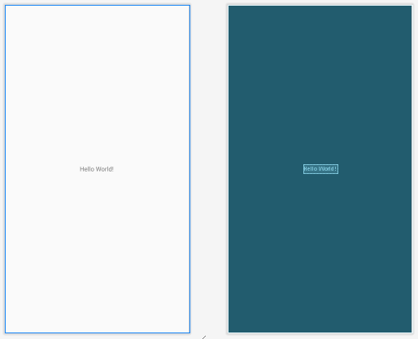
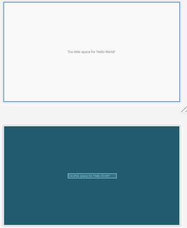

# Лабораторная работа №2. Activity Lifecycle. Alternative resources.
## Цели:
* Ознакомиться с жизненным циклом Activity.
* Изучить основные возможности и свойства Alternative resources.


## Задания (19 вариант):
### Задание 1. Activity.
В задании сказано продемонстрировать жизненный цикл Activity на любом нетривиальном примере, где тривиальным примером считаются: создание/открытие/закрытие приложения (кроме случаев нестандартного завершения работы: SIGKILL, Force Stop, etc.), а также поворот экрана.
Я изменил дефолтный MainActivity, чтобы в консоль выводились уведомления при вызове основных методов жизненного цикла приложения:

*	Как и предполагалось, при открытии приложения выводятся уведомления:


*	Приход сообщения, звонка и просмотр экрана уведомлений не привели ни к каким целевым уведомлениям в консоли.

*	Выход «домой»:


*	При открытии приложения через список ранее запущенных:


*	При выключении экрана:


*	При включении экрана:


### Задание 2. Alternative Resources.
19ый вариант преобразуется в 4ый - "Available height". 

Создадим альтернативный layout-ресурс (layout-h500dp) для нашего задания:


Предполагается, что если высота экрана составляет менее 500dp (например, при горизонтальном развороте Nexus One API 22), то будет высвечиваться сообщение "Too little space for 'Hello World!'", а иначе - "Hello World!":




Следует отметить, что конфигурация "Available height" используется редко, поскольку UI приложений, как правило, можно скроллить. Однако, при нехватке места на экране можно, например, автоматичеси свертывать подразделы списков, не интересующих пользователя. Это позволит уменьшить используемое экранное место при его нехватке.

### Задание 3. Best-matching resource.
```
Вариант 19:
====================================
Конфигурация устройства:
LOCALE_LANG: en
LOCALE_REGION: rCA
SCREEN_SIZE: large
SCREEN_ASPECT: notlong
ROUND_SCREEN: round
ORIENTATION: port
UI_MODE: desk
NIGHT_MODE: notnight
PIXEL_DENSITY: tvdpi
TOUCH: finger
PRIMARY_INPUT: 12key
NAV_KEYS: nonav
PLATFORM_VER: v25

Конфигурация ресурсов:
(default)
notlong-watch-wheel
en
rFR-notlong-round-xhdpi-nokeys
watch
fr-rCA-trackball-v26
round-land-notouch-nonav-v25
notlong-notnight-xhdpi-dpad-v27
rCA-land-notouch
small-long-ldpi-v25
normal-round-xxxhdpi-qwerty-v27

====================================
```

Следуя алгоритму Best-matching resource, первым делом исключаем конфигурации ресурсов, противоречащие конфигурации устройства:

(default)

~~notlong-watch-wheel~~             // wheel vs nonav

en

~~rFR-notlong-round-xhdpi-nokeys~~  // rFR vs rCA

~~watch~~                           // watch vs desk

~~fr-rCA-trackball-v26~~            // fr vs en

~~round-land-notouch-nonav-v25~~    // notouch vs finger

~~notlong-notnight-xhdpi-dpad-v27~~ // dpad vs nonav

~~rCA-land-notouch~~                // notouch vs finger

~~small-long-ldpi-v25~~             // long vs notlong

~~normal-round-xxxhdpi-qwerty-v27~~ // qwerty vs 12key


Между оставшимися двумя конфигурациями (по умолчанию и "en") выбираем "en", поскольку английский язык указан в конфигурации устройства (пункты 2-4 алгоритма из официальной документации).

### Задание 4. Сохранение состояние Activity.
Студент написал приложение "continuewatch". Это приложение по заданию должно считать, сколько секунд пользователь провел в этом приложении. Требуется найти ошибки в этом приложении и исправить их.

Для тестирования данного приложения был создан отдельный проект.

В процессе тестирования выяснилось, что приложение не сохраняет значение секундомера после закрытия приложения и поворота экрана (т.е. при каждом вызове метода onCreate() значение секундомера обнуляется). При этом, приложение продолжает считать, даже когда экран выключен или приложение не активно (после вызова методов onPause() или onStop()).

Решить проблемы удалось сохранением значения секундомера перед выходом из приложения, используя onSaveInstanceState() и onRestoreInstanceState(). Кроме этого, пришлось задействовать флаг doCount, разрешающий/запрещающий инкрементацию счётчика в потоке, а также функции onResume() и onPause(), соответственно устанавливающая/снимающая этот флаг.

## Вывод
Я ознакомился с жизненным циклом Activity. Он состоит из четырёх состояний: active, visible, stopped and destroyed. Я изучил основные возможности и свойства Alternate resourses, а также изучил принцип работы алгоритма для выбора best-matching resource.                                                                                                                                                                                                             

## Листинги:
### Задание 1, класс MainActivity
```
package com.example.lab1

import androidx.appcompat.app.AppCompatActivity
import android.os.Bundle
import android.util.Log
import com.example.lab2.R

class MainActivity : AppCompatActivity() {
    override fun onCreate(savedInstanceState: Bundle?) {
        super.onCreate(savedInstanceState)
        setContentView(R.layout.activity_main)
        Log.d("CREATION", "Created!")
    }

    override fun onStart() {
        super.onStart()
        Log.d("START", "Started!")
    }

    override fun onRestart() {
        super.onRestart()
        Log.d("RESTART", "Restarted!")
    }

    override fun onPause() {
        super.onPause()
        Log.d("PAUSE", "Paused!")
    }

    override fun onResume() {
        super.onResume()
        Log.d("RESUME", "Resume!")
    }

    override fun onDestroy() {
        super.onDestroy()
        Log.d("DESTROY", "Destroyed!")
    }

    override fun onStop() {
        super.onStop()
        Log.d("STOP", "Stopped!")
    }
}
```

### Задание 2, layout\activity_main.xml
```
<?xml version="1.0" encoding="utf-8"?>
<androidx.constraintlayout.widget.ConstraintLayout xmlns:android="http://schemas.android.com/apk/res/android"
    xmlns:app="http://schemas.android.com/apk/res-auto"
    xmlns:tools="http://schemas.android.com/tools"
    android:layout_width="match_parent"
    android:layout_height="match_parent"
    tools:context=".MainActivity">

    <TextView
        android:layout_width="wrap_content"
        android:layout_height="wrap_content"
        android:text="Too little space for 'Hello World!'"
        app:layout_constraintBottom_toBottomOf="parent"
        app:layout_constraintLeft_toLeftOf="parent"
        app:layout_constraintRight_toRightOf="parent"
        app:layout_constraintTop_toTopOf="parent" />

</androidx.constraintlayout.widget.ConstraintLayout>
```

### Задание 2, layout-h500dp\activity_main.xml
```
<?xml version="1.0" encoding="utf-8"?>
<androidx.constraintlayout.widget.ConstraintLayout
    xmlns:app="http://schemas.android.com/apk/res-auto"
    xmlns:android="http://schemas.android.com/apk/res/android"
    android:layout_width="match_parent"
    android:layout_height="match_parent">

    <TextView
        android:layout_width="wrap_content"
        android:layout_height="wrap_content"
        android:text="Hello World!"
        app:layout_constraintBottom_toBottomOf="parent"
        app:layout_constraintLeft_toLeftOf="parent"
        app:layout_constraintRight_toRightOf="parent"
        app:layout_constraintTop_toTopOf="parent" />

</androidx.constraintlayout.widget.ConstraintLayout>
```

### Задание 4, оригинальный класс MainActivity
```
package ru.spbstu.icc.kspt.lab2.continuewatch

import androidx.appcompat.app.AppCompatActivity
import android.os.Bundle
import kotlinx.android.synthetic.main.activity_main.*

class MainActivity : AppCompatActivity() {
    var secondsElapsed: Int = 0

    var backgroundThread = Thread {
        while (true) {
            Thread.sleep(1000)
            textSecondsElapsed.post {
                textSecondsElapsed.setText("Seconds elapsed: " + secondsElapsed++)
            }
        }
    }

    override fun onCreate(savedInstanceState: Bundle?) {
        super.onCreate(savedInstanceState)
        setContentView(R.layout.activity_main)
        backgroundThread.start()
    }
}
```

### Задание 4, исправленный класс MainActivity
```
package  com.example.lab2task4

import androidx.appcompat.app.AppCompatActivity
import android.os.Bundle
import kotlinx.android.synthetic.main.activity_main.*

class MainActivity : AppCompatActivity() {
    var secondsElapsed: Int = 0
    var doCount: Boolean = true
    val SECONDS = "0"

    var backgroundThread = Thread {
        while (true) {
            Thread.sleep(1000)
            if (doCount)
                textSecondsElapsed.post {
                    textSecondsElapsed.setText("Seconds elapsed: " + secondsElapsed++)
                }
        }
    }

    override fun onResume() {
        doCount = true
        super.onResume()
    }

    override fun onPause() {
        doCount = false
        super.onPause()
    }

    override fun onSaveInstanceState(outState: Bundle) {
        outState.run {
            putInt(SECONDS, secondsElapsed)
        }

        super.onSaveInstanceState(outState)
    }

    override fun onRestoreInstanceState(savedInstanceState: Bundle) {

        super.onRestoreInstanceState(savedInstanceState)

        savedInstanceState.run {
            secondsElapsed = getInt(SECONDS)
        }

    }

    override fun onCreate(savedInstanceState: Bundle?) {
        super.onCreate(savedInstanceState)
        setContentView(R.layout.activity_main)

        backgroundThread.start()
    }
    
}
```

PS На выполнение заданий 1-3 ушло чуть меньше часа времени. Исключением является последнее задание - не менее 1.5 часа.