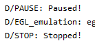
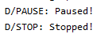

# Лабораторная работа №2. Activity Lifecycle. Alternative resources.
## Цели:
* Ознакомиться с жизненным циклом Activity.
* Изучить основные возможности и свойства Alternative resources.


## Задания (19 вариант):
### Задание 1. Activity.
В задании сказано продемонстрировать жизненный цикл Activity на любом нетривиальном примере, где тривиальным примером считаются: создание/открытие/закрытие приложения (кроме случаев нестандартного завершения работы: SIGKILL, Force Stop, etc.), а также поворот экрана.
Я изменил дефолтный MainActivity, чтобы в консоль выводились уведомления при вызове основных методов жизненного цикла приложения:
Как и предполагалось:
*	При открытии приложения выводятся уведомления:


*	Приход сообщения, звонок и просмотр экрана уведомлений не привели ни к каким целевым уведомлениям в консоли.
*	Выход «домой»:


*	При открытии приложения через список ранее запущенных:


*	При выключении экрана:


*	При включении экрана:


### Задание 2. Alternative Resources.
19ый вариант преобразуется в 4ый - "Available height". 

Создадим альтернативный layout-ресурс (layout-h500dp) для нашего задания:


Предполагается, что если высота экрана составляет менее 500dp (например, при горизонтальном развороте Nexus One API 22), то будет высвечиваться сообщение "Too little space for 'Hello World!'", а иначе - "Hello World!".

Следует отметить, что конфигурация "Available height" используется редко, поскольку UI приложений, как правило, можно скроллить.
Однако, при нехватке места на экране можно, например, автоматичеси свертывать подразделы списков, не интересующих пользователя.
## Листинги:
### Задание 1, класс MainActivity
```
package com.example.lab1

import androidx.appcompat.app.AppCompatActivity
import android.os.Bundle
import android.util.Log
import com.example.lab2.R

class MainActivity : AppCompatActivity() {
    override fun onCreate(savedInstanceState: Bundle?) {
        super.onCreate(savedInstanceState)
        setContentView(R.layout.activity_main)
        Log.d("CREATION", "Created!")
    }

    override fun onStart() {
        super.onStart()
        Log.d("START", "Started!")
    }

    override fun onRestart() {
        super.onRestart()
        Log.d("RESTART", "Restarted!")
    }

    override fun onPause() {
        super.onPause()
        Log.d("PAUSE", "Paused!")
    }

    override fun onResume() {
        super.onResume()
        Log.d("RESUME", "Resume!")
    }

    override fun onDestroy() {
        super.onDestroy()
        Log.d("DESTROY", "Destroyed!")
    }

    override fun onStop() {
        super.onStop()
        Log.d("STOP", "Stopped!")
    }
}
```

### Задание 2, layout\activity_main.xml
```
<?xml version="1.0" encoding="utf-8"?>
<androidx.constraintlayout.widget.ConstraintLayout xmlns:android="http://schemas.android.com/apk/res/android"
    xmlns:app="http://schemas.android.com/apk/res-auto"
    xmlns:tools="http://schemas.android.com/tools"
    android:layout_width="match_parent"
    android:layout_height="match_parent"
    tools:context=".MainActivity">

    <TextView
        android:layout_width="wrap_content"
        android:layout_height="wrap_content"
        android:text="Too little space for 'Hello World!'"
        app:layout_constraintBottom_toBottomOf="parent"
        app:layout_constraintLeft_toLeftOf="parent"
        app:layout_constraintRight_toRightOf="parent"
        app:layout_constraintTop_toTopOf="parent" />

</androidx.constraintlayout.widget.ConstraintLayout>
```

### Задание 2, layout-h500dp\activity_main.xml
```
<?xml version="1.0" encoding="utf-8"?>
<androidx.constraintlayout.widget.ConstraintLayout
    xmlns:app="http://schemas.android.com/apk/res-auto"
    xmlns:android="http://schemas.android.com/apk/res/android"
    android:layout_width="match_parent"
    android:layout_height="match_parent">

    <TextView
        android:layout_width="wrap_content"
        android:layout_height="wrap_content"
        android:text="Hello World!"
        app:layout_constraintBottom_toBottomOf="parent"
        app:layout_constraintLeft_toLeftOf="parent"
        app:layout_constraintRight_toRightOf="parent"
        app:layout_constraintTop_toTopOf="parent" />

</androidx.constraintlayout.widget.ConstraintLayout>
```